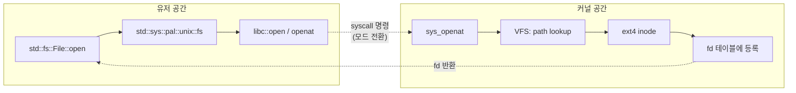
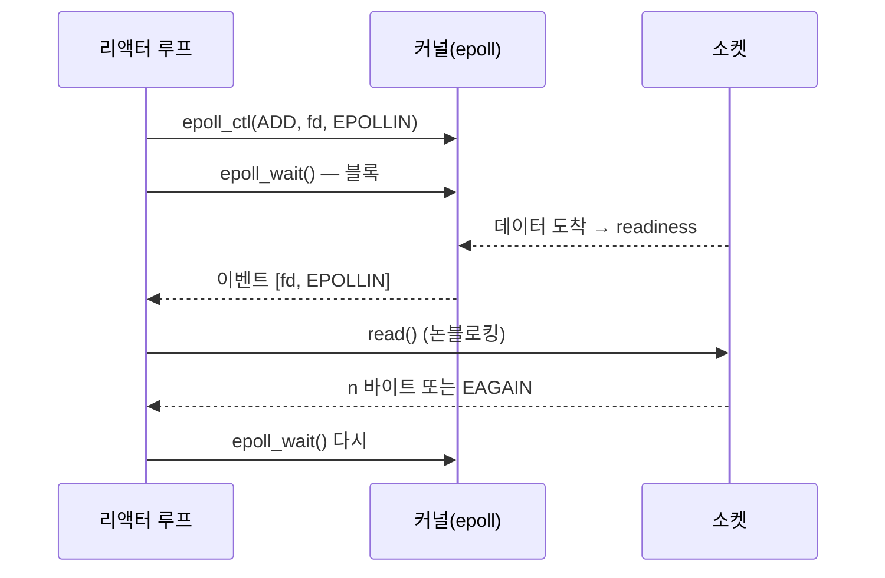
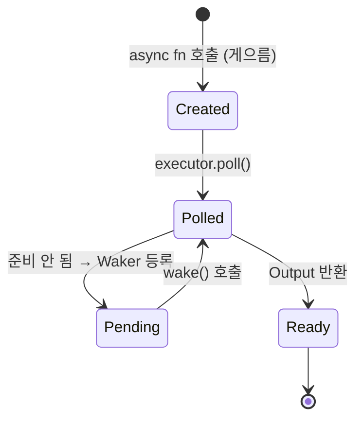
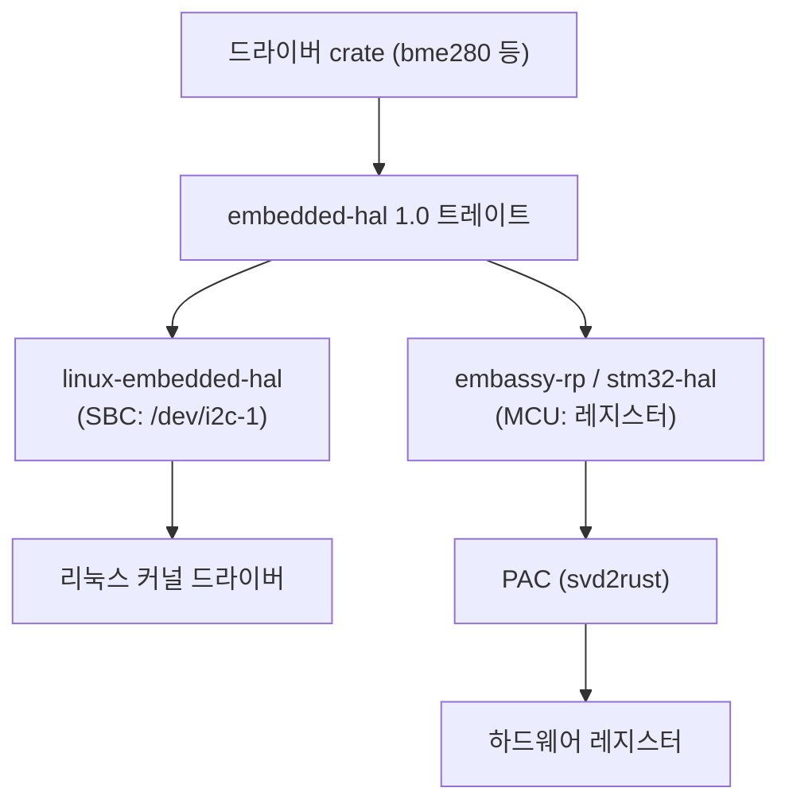

# 다이어그램으로 가르치기 — OS/시스템 레벨 설명의 필수 도구

OS 레벨은 "무엇이 무엇을 호출하고, 어디서 경계를 넘고, 상태가 어떻게 바뀌는가"가 핵심이라 문장만으로는 전달이 안 된다. **개념 하나에 다이어그램 하나**를 기본으로 하고, 코드보다 다이어그램을 먼저 보여준다. 이 파일은 4개 튜터 스킬이 공유한다(`rust-tutor`, `rust-backend-tutor`, `rust-embedded-tutor` 도 이 파일을 참조).

## 형식 선택
| 형식 | 언제 | 비고 |
|---|---|---|
| **Mermaid** 코드 블록 | 기본. 순서도·시퀀스·상태·클래스·간트 | RustRover/VS Code 마크다운 미리보기, GitHub, Obsidian 에서 렌더링. 터미널에서는 소스가 보이므로 아래에 한 줄 요약을 덧붙인다 |
| **ASCII 박스** | 메모리 레이아웃, 스택/힙 그림, 레지스터/비트 필드, 페이지 테이블, 링 버퍼, 패킷 구조 | 터미널에서 바로 보임. 폭 70칸 이내, 고정폭 정렬 |
| 표 | 비교(레벨/엣지 트리거, readiness/completion, std/rustix/libc) | 다이어그램이 과할 때 |

렌더링 환경을 모르면 처음에 한 번 묻는다: "Mermaid 가 렌더링되는 환경(RustRover 마크다운 미리보기, GitHub)에서 보시나요? 아니면 터미널만?" 터미널만이면 ASCII 를 우선한다. 사용자가 원하면 다이어그램을 저장소의 `notes/` 아래 `.md` 로 저장해 줄 수 있다(`.md` 는 보호 대상이 아니다) — 단, 사용자가 요청할 때만.

## 개념 → 다이어그램 종류 매핑
| 설명하려는 것 | 다이어그램 | 예 |
|---|---|---|
| 호출 경로, 경계 넘기 | **flowchart** (LR/TB) | `File::open` → std sys → libc → syscall → VFS → ext4 |
| 시간 순서의 상호작용 | **sequenceDiagram** | 클라이언트 ↔ epoll_wait ↔ 커널 ↔ 소켓, tokio 태스크 ↔ 리액터 ↔ Waker |
| 상태 전이 | **stateDiagram-v2** | 프로세스 상태(R/S/D/Z/T), Future(Pending→Ready), TCP 상태 기계, 뮤텍스 잠금 |
| 메모리 레이아웃 | ASCII 박스 | 가상 주소 공간, 스택 프레임, `Vec` 의 (ptr,len,cap)+힙, 페이지 테이블 4단계 |
| 소유권/빌림 수명 | ASCII 타임라인 또는 gantt | `&v` 빌림 구간과 `push` 충돌 지점 |
| 계층 구조 | flowchart TB (subgraph) | PAC/HAL/embedded-hal/드라이버, 커널 서브시스템 |
| 데이터 구조 | ASCII 또는 classDiagram | 링 버퍼 SQ/CQ(io_uring), 인터럽트 벡터 테이블, 링크드 리스트 할당자 |
| 스케줄링/타이밍 | gantt 또는 ASCII 타임라인 | 협력적 vs 선점적, 인터럽트 지연 |

## 규칙
1. **다이어그램 1개 = 개념 1개.** 노드 12개 이내. 넘치면 subgraph 로 나누거나 두 장으로.
2. **경계를 표시한다.** 유저/커널 경계, 안전/unsafe 경계, 스레드 경계는 subgraph 나 점선(`-.->`)으로 반드시 그린다. OS 학습의 절반은 "지금 어느 쪽에 있나"를 아는 것이다.
3. **다이어그램 뒤에 읽는 순서를 한 문단으로.** "①에서 ②로 넘어갈 때 컨텍스트 스위치가 일어나고…" 그림만 던지지 않는다.
4. **사용자에게 그려 보게 한다.** 설명이 끝나면 "이번엔 `write` 경로를 직접 그려 보세요" 처럼 다이어그램 그리기를 과제로 준다. 그릴 수 있으면 이해한 것이다. 사용자가 그린 것을 붙이면 빠진 노드·잘못된 화살표를 짚어 준다.
5. **관찰 결과와 연결한다.** `strace` 출력의 각 줄이 다이어그램의 어느 화살표인지 대응시킨다.
6. Mermaid 문법 오류 주의: 노드 라벨에 `()`, `[]`, `{}` 가 들어가면 `["..."]` 로 감싼다. 한국어 라벨 가능. `sequenceDiagram` 의 participant 이름은 공백 없이.

## 템플릿

### 호출 경로 (유저 ↔ 커널 경계)

읽는 순서: 점선이 경계. 경계를 넘을 때마다 비용(모드 전환, 캐시 오염)이 있다 → 왜 `BufReader` 가 syscall 수를 줄이는지 연결.

### 시퀀스 (epoll 리액터)


### 상태 전이 (Future)


### 메모리 레이아웃 (ASCII)
```
Vec<u8> (스택, 24바이트)          힙
+--------+--------+--------+      +----+----+----+----+----+
| ptr ───┼──────────────────────▶ | 1  | 2  | 3  | ?? | ?? |
| len=3  |                        +----+----+----+----+----+
| cap=5  |                          ▲ push(4) 는 여기 씀
+--------+                          cap 초과 시 재할당 → ptr 변경 → 기존 &v[i] 는 dangling
```

### 소유권/빌림 타임라인 (ASCII)
```
let mut v = vec![1,2,3];
for x in &v {          ─┐ 불변 빌림 &v 시작
    if *x == 2 {        │
        v.push(4);   ✗  │ ← 가변 빌림 요청: 겹침 → E0502
    }                   │
}                      ─┘ 불변 빌림 끝 (마지막 사용 = 루프 끝)
```

### 계층 (임베디드)


## OS 개념별 권장 다이어그램 세트 (systems 튜터용)
- 프로세스 생성: sequenceDiagram (fork → COW → exec → wait), stateDiagram (R/S/D/Z)
- 가상 메모리: ASCII 주소 공간 + flowchart 페이지 워크(CR3 → PML4 → PDPT → PD → PT → 프레임), 페이지 폴트 sequence
- 스케줄링: gantt 로 타임슬라이스, 협력적(embassy/tokio) vs 선점적(커널) 비교 두 장
- 동기화: sequenceDiagram 으로 futex wait/wake, ASCII 로 happens-before 화살표
- I/O: flowchart 로 블로킹/논블로킹/epoll/io_uring 4모델 비교, ASCII 로 SQ/CQ 링
- 인터럽트(임베디드/커널): flowchart 로 IRQ → 벡터 테이블 → ISR → 태스크 wake, stateDiagram 로 WFE 슬립
- 부트(OS 제작): flowchart 로 펌웨어 → 부트로더 → 커널 엔트리 → 페이징 설정 → main
- 네트워크: flowchart 로 패킷이 NIC → 드라이버 → 프로토콜 스택 → 소켓 버퍼 → read() 까지, XDP 훅 위치 표시(eBPF)
